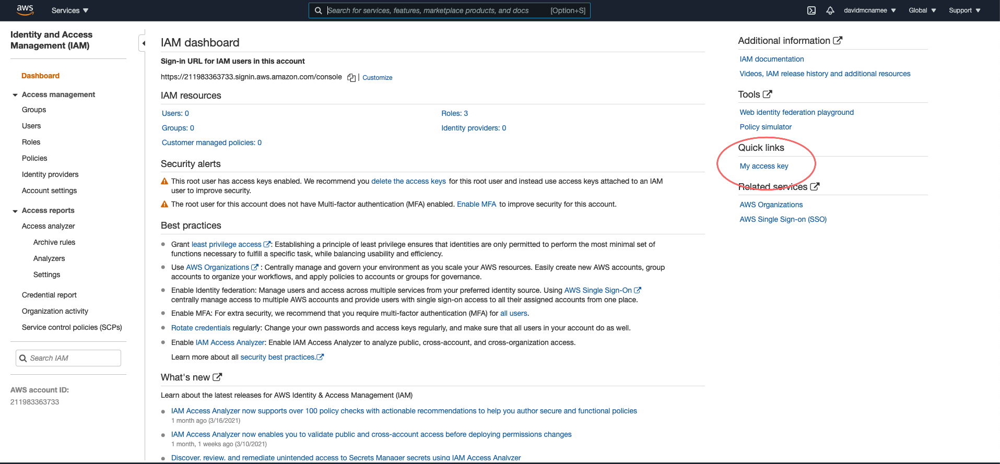
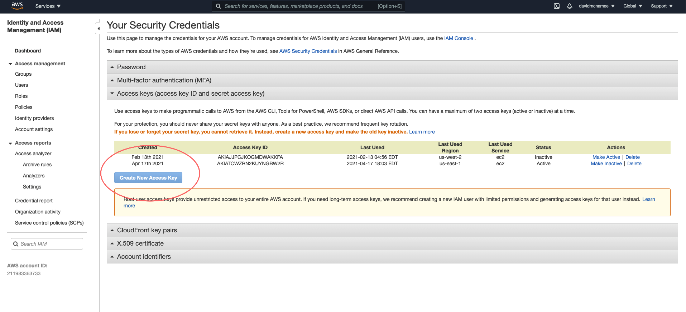

# free-tier AWS-RDS mysql server

## Setup

1. Sign up for an aws account and set up billing info
2. Go to [the IAM dashboard](https://console.aws.amazon.com/iam/home?region=us-east-1#/home) and click on "My access key"

3. Click on "Create new access key" and save it to a file

4. Create a file `~/.aws/config` with the following contents:

```
[default]
aws_access_key_id=<The20CharacterKeyTheyGiveYou>
aws_secret_access_key=<The40CharacterKeyTheyGiveYou>
```
(note: don't actually include the angle brackets)

5. Install terraform using `brew install terraform` (Mac) or `choco install terraform` (Windows)
6. Run `terraform apply` this will prompt you for a db password (this takes ~10mins). This will return the db address when it's finished.


### Accessing

Run `mysql --host=<TheAddressThatTerraformApplyGaveYou> --user=test_mysql_db --password=<ThePasswordYouGaveIt> testmysqldatabase`

Note: no space should be included after `-p`, and don't include any of the angle brackets – those are to show which arguments need to be provided by you.

### Destroying

Just run `terraform destroy` and make sure that it doesn't have any errors (this take ~10mins). If there are errors, running `terraform destroy` again will usually fix it.
